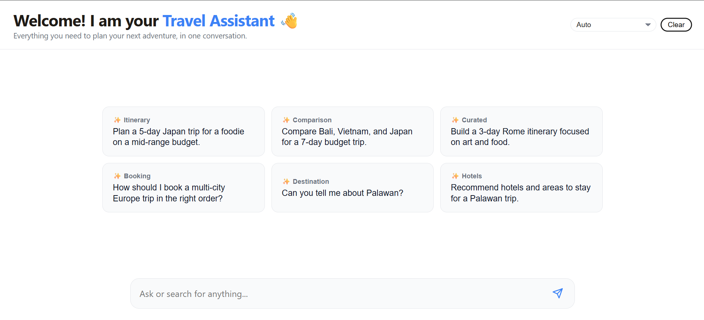

# Travel Assistant (OpenRouter Free Models)

A web app that provides destination advice, itineraries, budgets, and travel logistics. It uses OpenRouter's free router to generate responses and includes a clean, ChatGPT-style UI with a compact inline loading indicator.

## Highlights

- Travel-only guardrails to keep responses focused on trips, itineraries, and logistics
- Fast, responsive chat UI with prompt cards, auto-grow input, and inline thinking dots
- Multi-language UI with language selector and translated prompt cards
- OpenRouter integration with a server-side proxy for API key safety
- Clear, practical outputs with safety and budget awareness

## Tech Stack

- Frontend: HTML, CSS, Vanilla JavaScript
- Backend: Node.js, Express
- LLM Provider: OpenRouter (model: `openrouter/free`)

## Guardrails (Scope Control)

The assistant is explicitly instructed to focus only on travel planning. If a user asks unrelated questions, it politely declines and redirects the conversation to travel.

## Project Structure

- client/
   - index.html: UI structure
   - styles.css: Visual design and layout
   - app.js: App entry (ES modules)
   - modules/
      - constants.js: Prompts, labels, and base system message
      - dom.js: DOM references
      - i18n.js: UI translations helpers
      - systemMessage.js: Language-aware system prompt builder
      - prompts-ui.js: Prompt cards renderer
      - chat.js: Chat controller
- server/
   - index.js: Express app bootstrap
   - config/
      - systemPrompt.js: Guardrails and assistant scope
   - routes/
      - chat.js: Chat API route
   - services/
      - openrouter.js: OpenRouter client

## Setup

1. Install dependencies:
   - `npm install`
2. Create a `.env` file in the project root and add your key:
   - `OPENROUTER_API_KEY=your_key_here`
3. Start the server:
   - `npm run dev`

The app runs at `http://localhost:3000`.

## Scripts

- `npm run dev`: Start the Express server
- `npm start`: Start the Express server

## How It Works

1. The frontend builds a `conversation` array including a system message and user prompts.
2. The backend validates the payload and forwards it to OpenRouter.
3. The response is returned and rendered as a chat bubble.

OpenRouter parameters (current):

- `model`: `openrouter/free`
- `temperature`: `0.7`
- `max_tokens`: `1000`

## Example Prompts

- Plan a 5-day Japan trip for a foodie on a mid-range budget.
- Compare Bali, Vietnam, and Japan for a 7-day budget trip.
- Build a 3-day Rome itinerary focused on art and food.
- How should I book a multi-city Europe trip in the right order?
- Can you tell me about Palawan?
- Recommend hotels and areas to stay for a Palawan trip.

## Customization

- Update the guardrails in `server/config/systemPrompt.js` to adjust tone or scope.
- Modify prompt cards and translations in `client/modules/constants.js`.
- Adjust UI copy and labels via the translation map in `client/modules/constants.js`.
- Tweak layout and spacing in `client/styles.css` to match your portfolio branding.

## CI/CD (Recommended for Learning)

If you want to learn CI/CD for this project, the best place to start is GitHub Actions because it is widely used and beginner-friendly.

Suggested pipeline goals:

- Run install and basic checks on every push
- Keep environment secrets safe (OpenRouter key)
- Optional: deploy when merging to main

Common CI steps:

- `npm ci`
- `npm run lint` (if you add linting)
- `npm test` (if you add tests)

Common deployment paths:

- Render or Fly.io for a simple Express server
- Vercel or Netlify for static hosting (if you later split the API)

## Deployment (GitHub + Vercel)

Recommended flow:

1. Push the repo to GitHub.
2. Import the repository into Vercel.
3. Add the `OPENROUTER_API_KEY` in Vercel project settings (Environment Variables).
4. Deploy.

Notes:

- This project is a Node/Express server. If you deploy on Vercel, use the Node runtime with a single server entry at `server/index.js` (Vercel will auto-detect if configured).
- Alternatively, deploy the Express server to Render/Fly.io and keep Vercel for static hosting if you later split the API.

## Notes

- This app uses a server-side proxy, so your API key is never exposed in the browser.
- The UI preserves formatting from model outputs (lists and line breaks).
